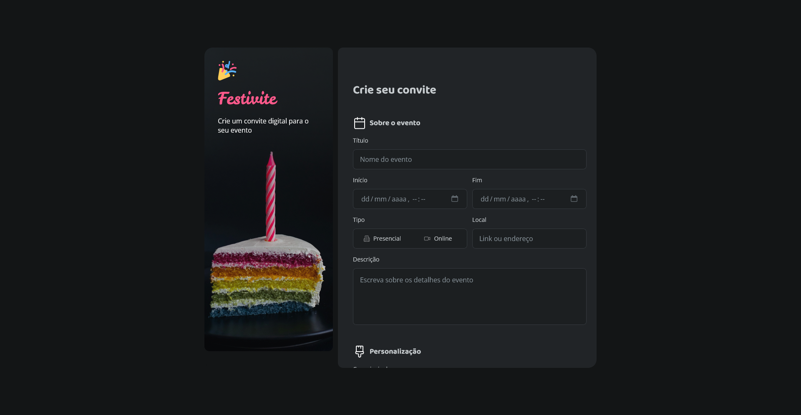

# Formulário de Convite

Formulário para geração de convites de festa, desenvolvido como desafio do curso de Full Stack da Rocketseat. O projeto foi construído inteiramente em HTML e CSS, a partir de um layout no Figma, incluindo componentes de interface como upload de arquivo, campos de texto com validação visual de erro e alternância de tema claro/escuro.



## 🔗 Deploy

Você pode acessar o projeto publicado através do link abaixo:

[https://higorgsantana.github.io/Formulario-de-convite/](https://higorgsantana.github.io/Formulario-de-convite/)

## 🚀 Tecnologias

- HTML5
- CSS3

## 💡 Funcionalidades

- Formulário de contato com campos de nome, e-mail e telefone
- Upload de imagem para o convite
- Validação visual de campos obrigatórios (borda e mensagem de erro)
- Checkboxes de termos e preferências de comunicação
- Layout responsivo construído com CSS Grid

## 📁 Como executar

Clone o repositório e abra o arquivo `index.html` no navegador:

```bash
git clone https://github.com/higorgsantana/Formulario-de-convite.git
cd Formulario-de-convite
```

## 📌 Sobre o desafio

Este projeto faz parte dos desafios práticos do curso de Full Stack da Rocketseat, com foco na reprodução fiel de um layout do Figma utilizando apenas HTML e CSS, sem uso de JavaScript.
